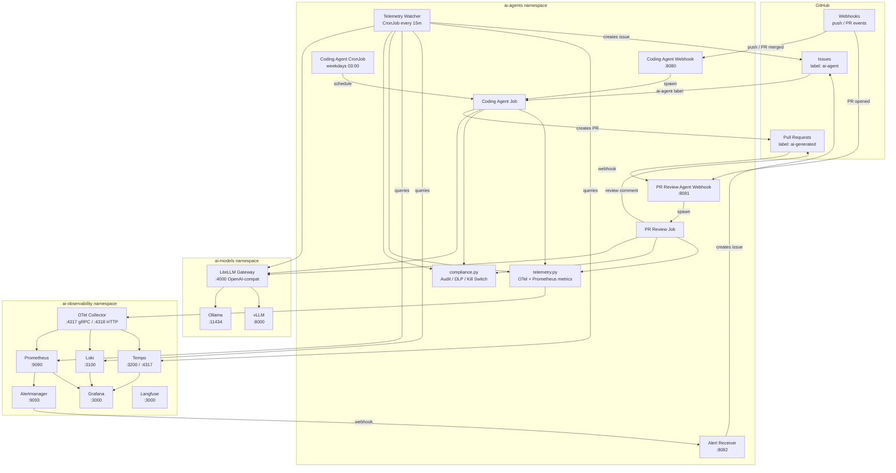
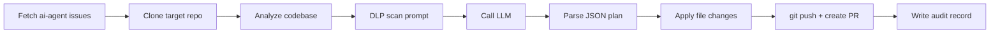
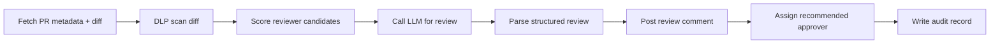
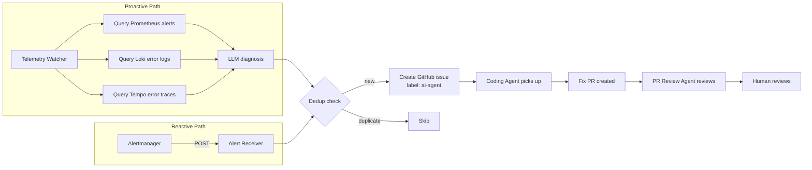
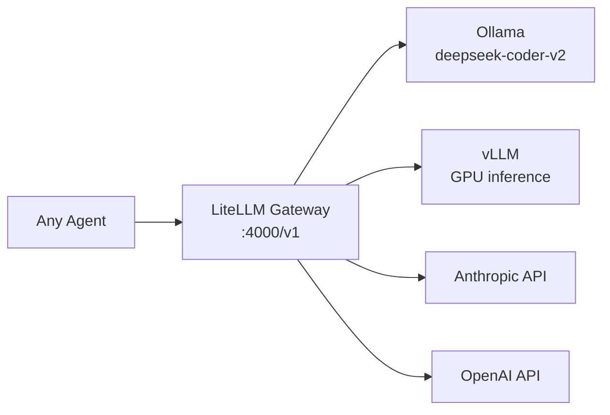
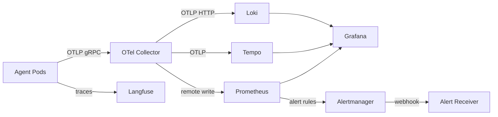

# Architecture

## Overview

Internal AI Agents is a platform that automates software engineering tasks -- code generation, pull request review, and self-healing -- using LLMs. It deploys to local Kubernetes, managed K8s (EKS/AKS/GKE), or fully serverless on AWS, Azure, or GCP. Every action produces a hash-chained audit trail aligned with MAS AIRG compliance requirements.



> The diagram above shows the Kubernetes deployment. Serverless deployments (AWS/Azure/GCP) replace K8s workloads with cloud-native compute but maintain the same data flows.

## Kubernetes Namespaces

| Namespace | Purpose | Key Resources |
|---|---|---|
| `ai-agents` | Agent workloads, webhooks, self-healing | Deployments, CronJobs, Jobs, Services, ConfigMaps, Secrets, RBAC |
| `ai-models` | Self-hosted LLM inference | Ollama, vLLM, LiteLLM proxy, PVCs for model storage |
| `ai-observability` | Full monitoring and tracing stack | OTel Collector, Prometheus, Alertmanager, Grafana, Langfuse, Loki, Tempo |

---

## Components

### Coding Agent

| Attribute | Detail |
|---|---|
| **Entry point** | `agents/coding-agent/coding_agent.py` |
| **Trigger** | CronJob (weekdays 03:00) or webhook (push / PR merged) |
| **Webhook** | `agents/coding-agent/webhook_listener.py` on port 8080 |
| **K8s resource** | CronJob `coding-agent-scheduled` + Deployment `coding-agent-webhook` |



**Context sources** (configurable via `CONTEXT_SOURCE`):
- `issues` -- fetches GitHub issues with label `ai-agent` (default)
- `roadmap_file` -- reads a roadmap file from the repo
- `manual` -- uses `MANUAL_PROMPT` env var

### PR Review Agent

| Attribute | Detail |
|---|---|
| **Entry point** | `agents/pr-review-agent/pr_review_agent.py` |
| **Trigger** | Webhook on `pull_request.opened` / `pull_request.synchronize` |
| **Webhook** | `agents/pr-review-agent/webhook_listener.py` on port 8081 |
| **K8s resource** | Deployment `pr-review-agent-webhook` |



**Review output** includes: risk level, recommendation (approve/request_changes/comment), issues with severity + category + file location + suggestion, strengths, and recommended approver with scoring breakdown.

### Self-Healing Pipeline

| Attribute | Detail |
|---|---|
| **Telemetry Watcher** | `agents/self-healing/telemetry_watcher.py` -- CronJob every 15 min |
| **Alert Receiver** | `agents/self-healing/alert_receiver.py` -- Deployment on port 8082 |
| **K8s manifests** | `k8s/base/self-healing/deployment.yaml` |



**Safeguards:**
- Confidence threshold (default 0.7) -- LLM must be above this to file an issue
- Cooldown window (default 30 min) -- prevents duplicate issues per alert fingerprint
- Dedup via fingerprint embedded in issue body
- Kill switch halts all agent operations

---

## Abstraction Layer (`agents/core/`)

All agents interact with external services through abstract interfaces, enabling a single codebase to run across all deployment targets.

```
agents/core/
  llm.py                # LLMProvider ABC -- inference calls
  audit.py              # AuditStore ABC -- hash-chained audit records
  config.py             # ConfigLoader ABC -- read configuration
  secrets.py            # SecretsLoader ABC -- retrieve secrets
  content_filter.py     # ContentFilter ABC -- DLP scanning
  observability.py      # ObservabilityProvider ABC -- metrics, traces, logging
  factory.py            # Runtime backend selection via CLOUD_PROVIDER env var
```

`factory.py` reads `CLOUD_PROVIDER` (default: `local`) and instantiates the correct backend using lazy imports with `@lru_cache`:

```python
CLOUD = os.environ.get("CLOUD_PROVIDER", "local").lower()

@lru_cache(maxsize=1)
def get_llm() -> LLMProvider:
    if CLOUD == "aws":
        from agents.backends.aws.llm_bedrock import BedrockProvider
        return BedrockProvider()
    elif CLOUD == "azure":
        from agents.backends.azure.llm_aoai import AzureOpenAIProvider
        return AzureOpenAIProvider()
    elif CLOUD == "gcp":
        from agents.backends.gcp.llm_vertex import VertexProvider
        return VertexProvider()
    from agents.backends.local.llm_ollama import OllamaProvider
    return OllamaProvider()
```

### Backend Implementations

| Interface | Local / Cloud-Agnostic K8s | AWS-Native | Azure-Native | GCP-Native |
|---|---|---|---|---|
| **LLM** | Ollama / LiteLLM / vLLM | Bedrock Converse API | Azure OpenAI Service | Vertex AI |
| **Audit** | Filesystem JSON | DynamoDB | Cosmos DB | Firestore |
| **Config** | Env + YAML files | SSM Parameter Store + S3 | App Configuration + Blob Storage | Firestore + Secret Manager |
| **Secrets** | Environment variables | Secrets Manager | Key Vault | Secret Manager |
| **DLP** | Regex scanner (10 patterns) | Bedrock Guardrails | AI Content Safety | Cloud DLP API |
| **Observability** | OTel + Prometheus + Langfuse | CloudWatch EMF + X-Ray | Application Insights + Azure Monitor | Cloud Monitoring + Cloud Trace |

### Portable Tools (`agents/tools/`)

Cloud-agnostic functions used by all agents regardless of deployment target:

| Module | Functions |
|---|---|
| `github_clone.py` | `clone(repo, branch, workdir)` |
| `github_issues.py` | `fetch_issues(repo, label)` |
| `codebase_analyzer.py` | `analyze(repo_path)` |
| `pr_fetcher.py` | `fetch_pr(repo, pr_number)` |
| `pr_commenter.py` | `post_comment(repo, pr_number, body)` |
| `reviewer_matcher.py` | `match(diff_files, reviewers_config)` |
| `git_operations.py` | `create_pr(repo, branch, title, body)` |
| `audit_writer.py` | `write(event_type, data)` -- delegates to `get_audit()` |

### Serverless Handlers (`agents/handlers/`)

Thin wrappers adapting agents to cloud function invocation models:

| Cloud | Handler | Entry Points |
|---|---|---|
| AWS | `agents/handlers/aws/lambda_handler.py` | `coding_agent_handler`, `review_agent_handler`, `watcher_handler` |
| Azure | `agents/handlers/azure/function_app.py` | HTTP triggers + timer trigger |
| GCP | `agents/handlers/gcp/cloud_function.py` | HTTP-triggered functions |

---

## Deployment Options

### 1. Local K8s (Default)

- **When**: Development, testing, on-premises
- **IaC**: Kustomize (`k8s/base/` + `k8s/overlays/local/`)
- **Compute**: K8s Jobs, CronJobs, Deployments
- **LLM**: Self-hosted via Ollama / LiteLLM / vLLM
- **Observability**: Full portable stack (OTel, Prometheus, Grafana, Loki, Tempo, Langfuse)
- **Lock-in**: None

### 2. Cloud-Agnostic K8s (EKS / AKS / GKE)

- **When**: Production with portable workloads on managed Kubernetes
- **IaC**: Terraform (`infra/terraform/cloud-agnostic/`) provisions the cluster only; Kustomize overlays (`k8s/overlays/{eks,aks,gke}`) deploy all workloads
- **Compute**: Same K8s workloads as local, with cloud-specific StorageClass and IAM identity annotations
- **Observability**: Same portable K8s stack
- **Lock-in**: Cluster provisioning only. All application components (agents, models, observability) are portable K8s workloads

Cloud-specific overlays add:
- **EKS**: `iam.amazonaws.com/role` pod annotations, `ebs.csi.aws.com` StorageClass
- **AKS**: `azure.workload.identity/use` labels, `disk.csi.azure.com` StorageClass
- **GKE**: `iam.gke.io/gcp-service-account` annotations, `pd.csi.storage.gke.io` StorageClass

### 3. AWS-Native Serverless

- **When**: Full AWS commitment, operational simplicity via serverless
- **IaC**: Terraform (`infra/terraform/aws-native/`)
- **Compute**: Lambda (15-min timeout) + Step Functions orchestration + EventBridge scheduling
- **LLM**: Amazon Bedrock (Converse API)
- **Observability**: CloudWatch EMF metrics + X-Ray traces + CloudWatch Logs
- **Terraform modules**: `foundation`, `lambdas`, `step-functions`, `eventbridge`, `bedrock`, `observability`

### 4. Azure-Native Serverless

- **When**: Full Azure commitment, enterprise SSO/AD integration
- **IaC**: Terraform (`infra/terraform/azure-native/`)
- **Compute**: Azure Functions + Durable Functions orchestration + Event Grid
- **LLM**: Azure OpenAI Service
- **Observability**: Application Insights + Log Analytics + Azure Monitor metric alerts
- **Terraform modules**: `foundation`, `functions`, `durable-functions`, `event-grid`, `openai`, `observability`

### 5. GCP-Native Serverless

- **When**: Full GCP commitment, Vertex AI ecosystem
- **IaC**: Terraform (`infra/terraform/gcp-native/`)
- **Compute**: Cloud Functions 2nd gen + Cloud Workflows orchestration + Eventarc / Cloud Scheduler
- **LLM**: Vertex AI Generative AI API
- **Observability**: Cloud Monitoring + Cloud Trace + Cloud Logging
- **Terraform modules**: `foundation`, `cloud-functions`, `cloud-workflows`, `eventarc`, `vertex-ai`, `observability`

---

## LLM Provider Layer

All agents connect to LLMs through the `LLMProvider` interface. In K8s deployments, the recommended setup routes everything through **LiteLLM**, which provides a single OpenAI-compatible endpoint.



Model aliases defined in `k8s/base/models/litellm/deployment.yaml`:

| Alias | Backend | Used by |
|---|---|---|
| `coding-model` | `ollama/deepseek-coder-v2:latest` | Coding Agent, Telemetry Watcher |
| `review-model` | `ollama/deepseek-coder-v2:latest` | PR Review Agent |

Swapping models requires only a ConfigMap change + rollout restart -- no code changes.

In serverless deployments, the `LLMProvider` directly calls the cloud-native LLM service (Bedrock, Azure OpenAI, Vertex AI) without the LiteLLM gateway.

---

## Observability

### Portable K8s Stack (Local + Cloud-Agnostic)



**Grafana dashboards:**
- **AI Agents -- Overview**: runs, PRs created, reviews posted, LLM latency, error rate, token usage
- **Self-Healing Pipeline**: watcher runs, firing alerts, issues created, diagnosis latency, pod restart rate

### Cloud-Native Observability

| Cloud | Metrics | Traces | Logs | Dashboards | Alerts |
|---|---|---|---|---|---|
| AWS | CloudWatch EMF | X-Ray | CloudWatch Logs | CloudWatch Dashboard | CloudWatch Alarms |
| Azure | Azure Monitor | Application Insights | Log Analytics | Azure Monitor Workbooks | Metric Alerts |
| GCP | Cloud Monitoring | Cloud Trace | Cloud Logging | Monitoring Dashboard | Alert Policies |

All backends implement the same `ObservabilityProvider` interface, so agent code is identical across deployments.

### Prometheus Alert Rules (K8s)

| Alert | Condition | Severity |
|---|---|---|
| `AgentJobFailed` | Job failed in ai-agents namespace | warning |
| `AgentHighLLMLatency` | p95 LLM call > 60s | warning |
| `AgentLLMErrors` | LLM error rate > 0.1/s | critical |
| `OllamaDown` | Ollama target down | critical |
| `LiteLLMDown` | LiteLLM target down | critical |
| `AppHighErrorRate` | 5xx rate > 5% | high |
| `AppPodCrashLooping` | Container restart rate > 0 | high |
| `AppOOMKilled` | Container OOM-killed | critical |
| `SelfHealingWatcherFailed` | Watcher job failed | warning |

---

## Compliance (MAS AIRG)

All deployment options maintain the same compliance posture through the abstract interface layer.

### Shared Modules

#### compliance.py

Delegates to the appropriate backend via `agents.core.factory`:

| Feature | Description |
|---|---|
| **Hash-chained audit trail** | Every event writes a JSON record; each record's hash includes the previous record's hash (SHA-256) |
| **Decision Validity Warrant** | Structured capture of facts, assumptions, reasoning, confidence, limitations |
| **DLP scanning** | Content filtered before LLM calls (regex local, Guardrails on AWS, Content Safety on Azure, Cloud DLP on GCP) |
| **Kill switch** | `COMPLIANCE_KILL_SWITCH=true` or config parameter halts all agents |
| **Provider allowlist** | `APPROVED_PROVIDERS` restricts which LLM backends agents can use |

#### telemetry.py

Facade over `ObservabilityProvider`:

| Feature | Description |
|---|---|
| **Tracing** | Spans exported via the active backend (OTel, X-Ray, App Insights, Cloud Trace) |
| **Metrics** | Counters and histograms: `agent_runs_total`, `agent_prs_created_total`, `agent_llm_call_duration_seconds`, etc. |

### Per-Deployment Compliance Details

| Concern | Local K8s | Cloud-Agnostic K8s | AWS-Native | Azure-Native | GCP-Native |
|---|---|---|---|---|---|
| **Audit storage** | Filesystem PV | Filesystem PV | DynamoDB | Cosmos DB | Firestore |
| **Audit durability** | PV backup | PV backup + snapshots | On-demand backup | Continuous backup | Point-in-time recovery |
| **Secret management** | K8s Secrets | K8s Secrets + cloud KMS | Secrets Manager | Key Vault | Secret Manager |
| **DLP engine** | Regex (10 patterns) | Regex (10 patterns) | Bedrock Guardrails | AI Content Safety | Cloud DLP API |
| **Network isolation** | K8s NetworkPolicy | K8s NetworkPolicy + VPC | VPC + Security Groups | VNet + NSG | VPC + Firewall Rules |
| **Identity** | K8s ServiceAccount | K8s SA + cloud identity | IAM Roles | Managed Identity | Service Account |
| **Encryption at rest** | Optional | Cloud KMS | KMS (default) | CMK (default) | CMEK (default) |

---

## FinOps

| Option | Cost Model | Primary Cost Drivers | Optimization Levers |
|---|---|---|---|
| **Local K8s** | CapEx (hardware) + OpEx (power, team) | GPU nodes, storage | Model quantization, right-size nodes |
| **Cloud-Agnostic K8s** | Managed K8s fee + node compute | Node hours, persistent volumes, egress | Spot/preemptible nodes, autoscaler, reserved instances |
| **AWS-Native** | Pay-per-invocation | Bedrock tokens, Lambda duration, DynamoDB RCU/WCU | Provisioned throughput, reserved capacity, model selection |
| **Azure-Native** | Consumption-based | Azure OpenAI tokens, Function executions, Cosmos RU | PTU provisioning, autoscale RU, consumption plan |
| **GCP-Native** | Per-invocation | Vertex AI tokens, Cloud Function vCPU-seconds, Firestore ops | Committed use discounts, model selection, batch processing |

All deployments should tag resources with `project=internal-agents` and `environment={dev,staging,prod}` for cost attribution.

---

## Repository Layout

```
internal-agents/
├── agents/
│   ├── core/                       # Abstract interfaces + factory
│   │   ├── llm.py                  # LLMProvider ABC
│   │   ├── audit.py                # AuditStore ABC
│   │   ├── config.py               # ConfigLoader ABC
│   │   ├── secrets.py              # SecretsLoader ABC
│   │   ├── content_filter.py       # ContentFilter ABC
│   │   ├── observability.py        # ObservabilityProvider ABC
│   │   └── factory.py              # CLOUD_PROVIDER dispatch
│   ├── backends/
│   │   ├── local/                  # Ollama, filesystem, regex, OTel
│   │   ├── aws/                    # Bedrock, DynamoDB, Guardrails, CloudWatch
│   │   ├── azure/                  # Azure OpenAI, Cosmos, Content Safety, App Insights
│   │   └── gcp/                    # Vertex AI, Firestore, Cloud DLP, Cloud Monitoring
│   ├── tools/                      # Portable functions (git, analysis, audit)
│   ├── handlers/
│   │   ├── aws/lambda_handler.py
│   │   ├── azure/function_app.py
│   │   └── gcp/cloud_function.py
│   ├── coding-agent/               # Coding agent logic + webhook
│   ├── pr-review-agent/            # PR review agent logic + webhook
│   ├── self-healing/               # Telemetry watcher + alert receiver
│   ├── compliance.py               # Audit, DLP, kill switch facade
│   └── telemetry.py                # Observability facade
├── k8s/
│   ├── base/                       # Kustomize base manifests
│   │   ├── configmap.yaml
│   │   ├── rbac.yaml
│   │   ├── self-healing/
│   │   ├── models/                 # Ollama, LiteLLM, vLLM
│   │   └── observability/          # OTel, Prometheus, Grafana, Langfuse, Loki, Tempo
│   └── overlays/
│       ├── local/                  # Docker Desktop / minikube
│       ├── eks/                    # AWS EKS (StorageClass, IAM)
│       ├── aks/                    # Azure AKS (Workload Identity)
│       └── gke/                    # GCP GKE (Workload Identity)
├── infra/terraform/
│   ├── aws-native/                 # Lambda, Step Functions, Bedrock, DynamoDB
│   ├── azure-native/               # Functions, Durable Functions, OpenAI, Cosmos
│   ├── gcp-native/                 # Cloud Functions, Workflows, Vertex AI, Firestore
│   └── cloud-agnostic/             # EKS / AKS / GKE cluster provisioning
├── docs/
│   ├── architecture.md             # This file
│   ├── cloud-deployment-plan.md    # Detailed migration plan
│   ├── mas-airg-compliance.md      # MAS AIRG gap analysis
│   └── self-healing-pipeline-demo.md
├── .github/                        # Issue templates, PR template, CODEOWNERS
├── Dockerfile                      # Multi-stage: 6 build targets
├── Makefile                        # Build, deploy, test, Terraform commands
├── requirements.txt                # Core Python dependencies
├── requirements-{aws,azure,gcp}.txt  # Cloud-specific dependencies
├── .env.example                    # Environment variable template
├── CONTRIBUTING.md
├── SECURITY.md
├── CHANGELOG.md
├── LICENSE                         # Apache 2.0
├── NOTICE                         # Apache 2.0 attribution
└── ROADMAP.md
```

## Data Flow Summary

| Flow | Path |
|---|---|
| **Issue -> Code -> PR** | GitHub Issue -> Coding Agent -> LLM -> git push -> PR |
| **PR -> Review** | PR opened -> PR Review Agent -> LLM -> review comment + assign |
| **Alert -> Issue -> Code -> PR -> Review** | Prometheus -> Alertmanager -> Alert Receiver -> Issue -> Coding Agent -> PR -> PR Review Agent |
| **Telemetry -> Diagnosis -> Issue** | Prometheus + Loki + Tempo -> Telemetry Watcher -> LLM diagnosis -> Issue |
| **Agent -> Metrics** | Agent -> ObservabilityProvider -> backend-specific pipeline |
| **Agent -> Audit** | Agent -> AuditStore -> backend-specific storage (hash-chained) |
| **Agent -> Trace** | Agent -> Langfuse SDK (K8s) or cloud tracing service (serverless) |

## Configuration

All configuration flows through environment variables, set via `.env` (local), K8s ConfigMaps/Secrets, or cloud-native config services.

| ConfigMap / Service | Scope | Contents |
|---|---|---|
| `agent-config` (K8s) | ai-agents | LLM provider, model, target repo, healing config, OTel settings |
| `agent-skills-rules` (K8s) | ai-agents | `skills.yaml`, `rules.yaml`, `reviewers.yaml` |
| `agent-secrets` (K8s) | ai-agents | GITHUB_TOKEN, GITHUB_WEBHOOK_SECRET |
| SSM Parameter Store (AWS) | aws-native | Same config as K8s ConfigMaps |
| App Configuration (Azure) | azure-native | Same config as K8s ConfigMaps |
| Firestore (GCP) | gcp-native | Same config as K8s ConfigMaps |
