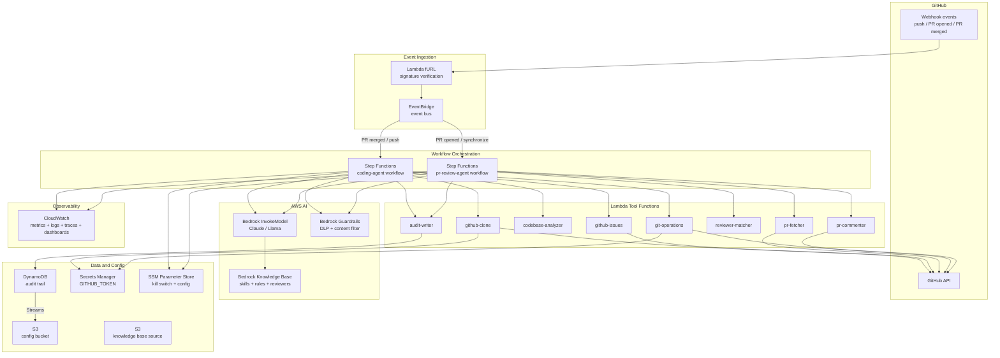
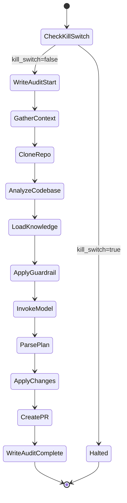
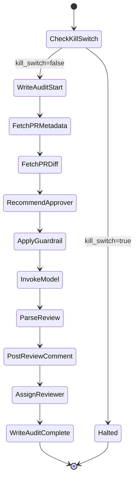
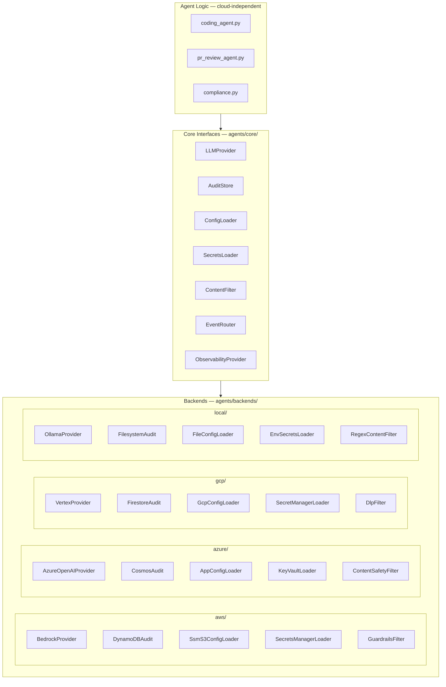

# Internal Agents — Cloud Deployment Plan

Two-track plan for moving internal-agents from local K8s to production cloud:

1. **AWS-native serverless** — 100% AWS managed services (Step Functions, Bedrock, EventBridge, Lambda, DynamoDB, CloudWatch)
2. **Cloud-agnostic abstraction layer** — swappable backends for AWS, Azure, GCP, and local, with Pulumi for multi-cloud IaC

---

# Part 1: Deploy Entirely on AWS Managed Services

## Design principle

Every component uses an AWS managed service. No containers, no self-hosted runtimes, no custom servers. The agents become serverless workflows that call AWS services at each step.

## Architecture



## Component mapping (current -> AWS)

- **Agent workflow** (Python `run()` / `review_pr()`) --> **Step Functions** state machines with explicit steps
- **LLM calls** (Ollama / LiteLLM / Anthropic / OpenAI) --> **Bedrock InvokeModel** (direct Step Functions integration, zero code)
- **DLP scanning** (custom regex in `compliance.py`) --> **Bedrock Guardrails** `ApplyGuardrail` API (PII, credentials, content filters)
- **Skills / rules / reviewers knowledge** (K8s ConfigMap YAML) --> **Bedrock Knowledge Base** backed by S3 (RAG retrieval in Bedrock calls)
- **Webhook listeners** (Flask + K8s Job spawning) --> **EventBridge** (GitHub -> Lambda fURL -> event bus -> rules -> Step Functions)
- **Tool functions** (inline Python in agent scripts) --> **Lambda functions** (one per tool, invoked by Step Functions)
- **Audit trail** (filesystem JSON) --> **DynamoDB** (hash-chained, GSI, Streams to S3)
- **Kill switch** (ConfigMap / env var) --> **SSM Parameter Store** (checked by Step Functions Choice state)
- **Secrets** (K8s Secrets) --> **Secrets Manager** (Lambda reads at invocation via SDK)
- **Config** (K8s ConfigMaps) --> **SSM Parameter Store** (flat config) + **S3** (YAML files for Knowledge Base)
- **Observability** (OTel + Prometheus + Grafana + Langfuse) --> **CloudWatch** (Step Functions auto-logs every state transition, X-Ray traces, custom metrics, dashboards)
- **Container images** (Dockerfile + GHCR) --> **Not needed** (all Lambda, no containers)
- **K8s manifests / Kustomize** --> **CDK** (TypeScript)

## Step Functions workflow: coding-agent



Each box is either:
- A **Lambda invocation** (tool steps like CloneRepo, AnalyzeCodebase, CreatePR)
- A **Bedrock SDK call** (InvokeModel, ApplyGuardrail -- native Step Functions integration, no Lambda needed)
- A **DynamoDB PutItem** (audit writes -- native Step Functions integration)
- An **SSM GetParameter** (kill switch check -- native Step Functions integration)

## Step Functions workflow: pr-review-agent



## Lambda functions to build

Each replaces a section of the current Python agent code:

- **`github-clone`**: Clones repo to `/tmp` (or EFS for large repos), returns codebase summary. Extracts logic from `analyze_codebase()` in `coding_agent.py`
- **`github-issues`**: Fetches issues labelled for agent. Extracts `fetch_context_from_issues()`
- **`codebase-analyzer`**: Builds repo structure summary. Extracts `analyze_codebase()`
- **`pr-fetcher`**: Fetches PR metadata + diff. Extracts `fetch_pr_metadata()` + `fetch_pr_diff()`
- **`pr-commenter`**: Posts review comment, assigns reviewer. Extracts `post_review_comment()` + `assign_reviewer()`
- **`reviewer-matcher`**: Scores reviewers. Extracts `recommend_approver()` -- reads `reviewers.yaml` from S3
- **`git-operations`**: Applies file changes, commits, pushes, creates PR. Extracts `apply_changes()` + `create_pr()`
- **`audit-writer`**: Writes hash-chained audit record to DynamoDB. Extracts `write_audit_record()` from `compliance.py`

All Lambdas: Python 3.12 runtime, read secrets from Secrets Manager, use `PyGithub` or `gh` CLI (via Lambda layer).

## Bedrock Guardrails (replaces `compliance.py` DLP)

Create a Guardrail with:
- **PII filters**: SSN, NRIC, credit card numbers (BLOCK on input)
- **Sensitive info filters**: regex patterns for `ghp_*`, `sk-*`, `aws_access_key_id`, private keys, passwords (BLOCK on input)
- **Content filters**: optional toxicity/harm filters

Use `ApplyGuardrail` API in the Step Functions workflow before sending prompt to Bedrock, replacing `scan_for_sensitive_data()` and `redact_sensitive_data()`.

The rest of `compliance.py` (hash chain, DVW, kill switch, provider allowlist) moves to:
- Hash chain logic -> `audit-writer` Lambda
- DVW builder -> inline in Step Functions output processing
- Kill switch -> SSM Parameter Store + Step Functions Choice state
- Provider allowlist -> not needed (Bedrock is the only provider)

## Bedrock Knowledge Base (replaces ConfigMap YAML)

- S3 bucket holds `skills.yaml`, `rules.yaml`, `reviewers.yaml`
- Bedrock Knowledge Base indexes these with an embedding model
- Bedrock InvokeModel retrieves relevant context automatically when the agent prompt references skills/rules
- Updates: just upload new YAML to S3, Knowledge Base re-syncs

## EventBridge webhook routing (replaces Flask listeners)

```
GitHub webhook --> Lambda fURL (HMAC verify) --> EventBridge bus
                                                    |
                    +-------------------------------+-------------------------------+
                    |                                                               |
          Rule: pull_request.opened                                    Rule: pull_request.closed+merged
          Rule: pull_request.synchronize                               Rule: push
                    |                                                               |
                    v                                                               v
          Start SFN: pr-review-agent                                   Start SFN: coding-agent
```

EventBridge rules use event pattern matching on `detail.action` and `detail.event` fields.

## DynamoDB audit table schema

- Table: `agent-audit-trail`
- Partition key: `PK` = `RUN#<run_id>`
- Sort key: `SK` = `RECORD#<record_id>`
- GSI `by-timestamp`: partition key `agent_name`, sort key `timestamp`
- GSI `by-repo`: partition key `target_repo`, sort key `timestamp`
- Special item: `PK=CHAIN#HEAD`, `SK=CHAIN#HEAD` stores current chain hash
- TTL attribute for automatic expiry (or disable for full MAS AIRG 7-year retention)
- DynamoDB Streams -> Kinesis Firehose -> S3 for long-term archival

## What is completely removed

- `Dockerfile` -- no containers needed
- `Makefile` -- replaced by CDK deploy commands
- `k8s/` directory -- all manifests, overlays, Kustomize
- `agents/telemetry.py` -- CloudWatch handles everything via Step Functions auto-logging
- `agents/coding-agent/webhook_listener.py` -- replaced by EventBridge
- `agents/pr-review-agent/webhook_listener.py` -- replaced by EventBridge
- Ollama, LiteLLM, vLLM, Langfuse, Prometheus, Grafana, OTel Collector, Loki, Tempo -- all gone
- Kagent CRDs -- not needed
- Flask, gunicorn, kubernetes Python packages -- not needed

## CDK project structure

```
infra/
  cdk/
    bin/app.ts
    lib/
      foundation-stack.ts      # DynamoDB, S3, SSM, Secrets Manager, IAM
      eventbridge-stack.ts     # Event bus, Lambda fURL, routing rules
      lambdas-stack.ts         # All Lambda tool functions
      bedrock-stack.ts         # Guardrails, Knowledge Base
      coding-agent-stack.ts    # Step Functions state machine
      review-agent-stack.ts    # Step Functions state machine
      observability-stack.ts   # CloudWatch dashboards, alarms, SNS topics
    lambda/
      github_clone/handler.py
      github_issues/handler.py
      codebase_analyzer/handler.py
      pr_fetcher/handler.py
      pr_commenter/handler.py
      reviewer_matcher/handler.py
      git_operations/handler.py
      audit_writer/handler.py
      webhook_receiver/handler.py
```

## Estimated cost (5 teams, moderate usage)

- Bedrock InvokeModel: ~$50-200/mo (model-dependent)
- Bedrock Knowledge Base: ~$5-10/mo
- Bedrock Guardrails: ~$5-15/mo
- Step Functions: ~$5-10/mo (standard workflows)
- Lambda: ~$2-10/mo
- EventBridge: negligible
- DynamoDB: ~$5-10/mo (on-demand)
- S3: ~$1/mo
- Secrets Manager + SSM: ~$2/mo
- CloudWatch: ~$10-20/mo
- **Total: ~$85-280/mo** (fully serverless, zero idle cost)

## Migration effort

~4-5 weeks for a single engineer.

---

# Part 2: Multi-Cloud Component Mapping

If you want to replicate this architecture on Azure or GCP using each cloud's fully managed services, here is the component-by-component equivalent.

## Full mapping table

### Workflow orchestration (replaces K8s CronJobs / agent `run()` loop)

- **AWS**: Step Functions (state machine, native Bedrock/DynamoDB/SSM integrations)
- **Azure**: Durable Functions (code-based orchestration in Azure Functions) or Logic Apps (low-code, 1400+ connectors)
- **GCP**: Cloud Workflows (YAML-based, native service integrations via HTTP connectors)

### LLM inference (replaces Ollama / LiteLLM)

- **AWS**: Bedrock InvokeModel (Claude, Llama, Mistral, Nova)
- **Azure**: Azure OpenAI Service (GPT-4o, o1, o3) or Foundry model catalog
- **GCP**: Vertex AI Gemini API (Gemini, Claude via Model Garden, Llama)

### Agent platform (if you want managed agent orchestration instead of Step Functions)

- **AWS**: Bedrock Agents (managed ReAct loop + action groups) or AgentCore (custom runtime)
- **Azure**: Foundry Agent Service (prompt agents, workflow agents, hosted agents with LangGraph/custom code)
- **GCP**: Vertex AI Agent Engine (deploy agents built with ADK, LangGraph, LangChain; managed runtime + memory + eval)

### DLP / content filtering (replaces custom regex in `compliance.py`)

- **AWS**: Bedrock Guardrails (PII filters, sensitive info regex, content filters; `ApplyGuardrail` API)
- **Azure**: Azure AI Content Safety (text moderation, PII detection, prompt shields, groundedness detection)
- **GCP**: Vertex AI Safety Filters (harm categories, PII detection via DLP API, responsible AI toolkit)

### Knowledge base / RAG (replaces ConfigMap-mounted skills.yaml / rules.yaml)

- **AWS**: Bedrock Knowledge Bases (S3 source, managed embeddings + vector store, auto-retrieval in agent calls)
- **Azure**: Azure AI Search + Foundry (index documents, integrated with Azure OpenAI for RAG)
- **GCP**: Vertex AI RAG Engine / Vertex AI Search (managed chunking, embedding, retrieval from Cloud Storage)

### Event routing (replaces Flask webhook listeners)

- **AWS**: EventBridge (GitHub -> Lambda fURL -> event bus -> rules -> Step Functions)
- **Azure**: Event Grid + Azure Functions (GitHub webhook -> Function endpoint -> Event Grid topic -> subscriptions -> Durable Functions)
- **GCP**: Eventarc + Cloud Functions (GitHub webhook -> Cloud Function endpoint -> Eventarc -> Cloud Workflows trigger)

### Serverless compute / tool functions (replaces inline Python in agent scripts)

- **AWS**: Lambda (Python 3.12, 15 min max, 10 GB memory)
- **Azure**: Azure Functions (Python, consumption plan, 10 min default / 60 min on premium)
- **GCP**: Cloud Functions 2nd gen / Cloud Run functions (Python, 60 min max, built on Cloud Run)

### NoSQL audit store (replaces PVC-backed JSON files)

- **AWS**: DynamoDB (on-demand, Streams to S3, TTL, GSI)
- **Azure**: Cosmos DB (serverless, Change Feed to Blob Storage, TTL, composite indexes)
- **GCP**: Firestore (serverless, export to Cloud Storage, TTL, composite indexes)

### Object storage (config files, long-term audit archive)

- **AWS**: S3
- **Azure**: Blob Storage
- **GCP**: Cloud Storage

### Secrets management (replaces K8s Secrets)

- **AWS**: Secrets Manager (auto-rotation, cross-account, SDK access)
- **Azure**: Key Vault (certificates + keys + secrets, RBAC, managed identity access)
- **GCP**: Secret Manager (versioned secrets, IAM-controlled, SDK access)

### Configuration store (replaces K8s ConfigMaps, kill switch)

- **AWS**: SSM Parameter Store (free tier for standard params, instant reads)
- **Azure**: App Configuration (feature flags, key-value, change notifications via Event Grid)
- **GCP**: Runtime Configurator or Secret Manager (for config values) + Firestore (for feature flags)

### Observability (replaces OTel Collector + Prometheus + Grafana + Langfuse + Loki + Tempo)

- **AWS**: CloudWatch (metrics, logs, traces via X-Ray, dashboards, alarms, anomaly detection)
- **Azure**: Azure Monitor + Application Insights (metrics, logs, distributed tracing, dashboards, alerts, Live Metrics)
- **GCP**: Cloud Monitoring + Cloud Trace + Cloud Logging (metrics, traces, logs, dashboards, alerting policies)

### Identity and access (replaces K8s RBAC + ServiceAccounts)

- **AWS**: IAM roles + resource policies (least-privilege per Lambda/Step Function)
- **Azure**: Entra ID + Managed Identity + RBAC (passwordless auth between services)
- **GCP**: IAM + Workload Identity Federation (service accounts per function)

### Infrastructure as Code (replaces Kustomize / kubectl)

- **AWS**: CDK (TypeScript/Python)
- **Azure**: Bicep (native) or Pulumi
- **GCP**: Pulumi or Terraform (Cloud Deployment Manager is limited)

## Architecture pattern per cloud

```mermaid
flowchart TB
  subgraph aws_col [AWS]
    direction TB
    aws_eb["EventBridge"]
    aws_sfn["Step Functions"]
    aws_lambda["Lambda"]
    aws_bedrock["Bedrock"]
    aws_guard["Bedrock Guardrails"]
    aws_kb["Bedrock Knowledge Bases"]
    aws_ddb["DynamoDB"]
    aws_cw["CloudWatch"]
  end

  subgraph azure_col [Azure]
    direction TB
    az_eg["Event Grid"]
    az_df["Durable Functions"]
    az_func["Azure Functions"]
    az_aoai["Azure OpenAI"]
    az_safety["AI Content Safety"]
    az_search["AI Search"]
    az_cosmos["Cosmos DB"]
    az_monitor["Azure Monitor"]
  end

  subgraph gcp_col [GCP]
    direction TB
    gcp_ea["Eventarc"]
    gcp_wf["Cloud Workflows"]
    gcp_cf["Cloud Functions"]
    gcp_vertex["Vertex AI Gemini"]
    gcp_dlp["Vertex AI Safety / DLP"]
    gcp_rag["Vertex AI RAG Engine"]
    gcp_fs["Firestore"]
    gcp_cm["Cloud Monitoring"]
  end
```



## Key differences to watch

### Workflow orchestration maturity
- **AWS Step Functions** has the deepest native SDK integrations (Bedrock, DynamoDB, SSM, SNS all callable without Lambda)
- **Azure Durable Functions** is code-first (Python/C#/JS), more flexible but requires more code
- **GCP Cloud Workflows** is YAML-based, simpler but fewer native connectors -- most steps need HTTP calls to service APIs

### LLM model access
- **AWS Bedrock**: broadest multi-provider catalog (Anthropic, Meta, Mistral, Cohere, Amazon Nova)
- **Azure OpenAI**: exclusive access to OpenAI models (GPT-4o, o1, o3); also hosts some open models
- **GCP Vertex AI**: Gemini (native) + Claude and others via Model Garden; strongest for Gemini-first workloads

### Agent platform maturity
- **AWS**: AgentCore is most production-hardened (session isolation, 8h runs, A2A protocol)
- **Azure**: Foundry Agent Service is newest, tight Microsoft 365/Teams integration
- **GCP**: Vertex AI Agent Engine is solid, strong ADK framework, good eval tooling

### DLP / guardrails
- **AWS Bedrock Guardrails**: works inline with Bedrock calls, `ApplyGuardrail` standalone API
- **Azure AI Content Safety**: standalone service, works with any model, prompt shields are unique
- **GCP DLP API**: most granular PII detection (200+ info types), but separate from Vertex AI inference path

### Cost model
All three are pay-per-use serverless. Main cost driver is LLM token consumption, which varies by model pricing:
- AWS Bedrock Claude Sonnet: ~$3 / $15 per million input/output tokens
- Azure OpenAI GPT-4o: ~$2.50 / $10 per million input/output tokens
- GCP Vertex Gemini 2.5 Pro: ~$1.25 / $10 per million input/output tokens

---

# Part 3: Cloud-Agnostic Architecture

## Design principle

Agent business logic depends only on abstract interfaces. Cloud-specific SDKs live in swappable backend modules. A single `CLOUD_PROVIDER` env var selects which backends to load at runtime. IaC uses Pulumi (Python) so one codebase deploys to any cloud.

## Layered architecture



## Project structure

```
agents/
  core/                         # Abstract interfaces (no cloud imports)
    __init__.py
    llm.py                      # class LLMProvider(ABC)
    audit.py                    # class AuditStore(ABC)
    config.py                   # class ConfigLoader(ABC)
    secrets.py                  # class SecretsLoader(ABC)
    content_filter.py           # class ContentFilter(ABC)
    observability.py            # class ObservabilityProvider(ABC)
    factory.py                  # get_llm(), get_audit(), etc. based on CLOUD_PROVIDER

  backends/
    aws/
      __init__.py
      llm_bedrock.py            # boto3 bedrock-runtime converse()
      audit_dynamodb.py         # boto3 dynamodb put_item() with hash chain
      config_ssm_s3.py          # boto3 ssm get_parameter() + s3 get_object()
      secrets_sm.py             # boto3 secretsmanager get_secret_value()
      filter_guardrails.py      # boto3 bedrock-runtime apply_guardrail()
      observability_cw.py       # CloudWatch embedded metrics format
    azure/
      __init__.py
      llm_aoai.py               # openai.AzureOpenAI client
      audit_cosmos.py           # azure-cosmos upsert_item() with hash chain
      config_appconfig.py       # azure-appconfiguration client
      secrets_keyvault.py       # azure-keyvault-secrets client
      filter_content_safety.py  # azure-ai-contentsafety client
      observability_monitor.py  # opencensus / azure-monitor-opentelemetry
    gcp/
      __init__.py
      llm_vertex.py             # google-cloud-aiplatform GenerativeModel
      audit_firestore.py        # google-cloud-firestore with hash chain
      config_sm.py              # google-cloud-secret-manager (for config YAML)
      secrets_sm.py             # google-cloud-secret-manager (for secrets)
      filter_dlp.py             # google-cloud-dlp inspect_content()
      observability_cm.py       # google-cloud-monitoring + google-cloud-trace
    local/
      __init__.py
      llm_ollama.py             # existing Ollama/LiteLLM code (extracted)
      audit_filesystem.py       # existing JSON file audit (extracted)
      config_file.py            # existing YAML file loader (extracted)
      secrets_env.py            # existing os.environ loader (extracted)
      filter_regex.py           # existing DLP regex scanner (extracted)
      observability_otel.py     # existing OTel + Prometheus code (extracted)

  tools/                        # Portable tool functions (used by Lambda, Azure Functions, Cloud Functions, or locally)
    github_clone.py             # extracted from coding_agent.py
    github_issues.py            # extracted from coding_agent.py
    codebase_analyzer.py        # extracted from coding_agent.py
    pr_fetcher.py               # extracted from pr_review_agent.py
    pr_commenter.py             # extracted from pr_review_agent.py
    reviewer_matcher.py         # extracted from pr_review_agent.py
    git_operations.py           # extracted from coding_agent.py
    audit_writer.py             # extracted from compliance.py

  coding-agent/
    coding_agent.py             # refactored: uses core interfaces only
    agent.yaml                  # canonical workflow definition (unchanged)
  pr-review-agent/
    pr_review_agent.py          # refactored: uses core interfaces only
    agent.yaml                  # canonical workflow definition (unchanged)
  compliance.py                 # refactored: DVW + kill switch use core interfaces

infra/
  pulumi/
    Pulumi.yaml
    Pulumi.aws.yaml             # AWS-specific config
    Pulumi.azure.yaml           # Azure-specific config
    Pulumi.gcp.yaml             # GCP-specific config
    __main__.py                 # reads stack name, dispatches to cloud module
    stacks/
      aws.py                    # Step Functions, Lambda, EventBridge, DynamoDB, Bedrock, CloudWatch
      azure.py                  # Durable Functions, Azure Functions, Event Grid, Cosmos DB, Azure OpenAI, Monitor
      gcp.py                    # Cloud Workflows, Cloud Functions, Eventarc, Firestore, Vertex AI, Cloud Monitoring
    shared/
      config.py                 # shared Pulumi config (agent names, table schemas, etc.)
```

## Interface definitions

### LLMProvider

```python
# agents/core/llm.py
from abc import ABC, abstractmethod

class LLMProvider(ABC):
    @abstractmethod
    def call(self, system: str, prompt: str, model: str, max_tokens: int) -> str:
        """Send a chat completion request. Returns the model response text."""
        ...

    @abstractmethod
    def apply_content_filter(self, text: str, direction: str) -> tuple[str, list[dict]]:
        """Scan text for sensitive content. Returns (filtered_text, findings).
        direction: 'input' or 'output'."""
        ...
```

### AuditStore

```python
# agents/core/audit.py
from abc import ABC, abstractmethod
from agents.compliance import AuditRecord

class AuditStore(ABC):
    @abstractmethod
    def write_record(self, record: AuditRecord) -> str:
        """Write a hash-chained audit record. Returns record_hash."""
        ...

    @abstractmethod
    def get_chain_head(self) -> str:
        """Return the current chain head hash."""
        ...

    @abstractmethod
    def verify_chain(self) -> dict:
        """Verify full audit chain integrity. Returns verification report."""
        ...

    @abstractmethod
    def query_by_time(self, agent_name: str, start: str, end: str) -> list[dict]:
        """Query audit records by time range."""
        ...
```

### ConfigLoader

```python
# agents/core/config.py
from abc import ABC, abstractmethod

class ConfigLoader(ABC):
    @abstractmethod
    def get_parameter(self, key: str) -> str:
        """Read a single config value (kill switch, feature flag, etc.)."""
        ...

    @abstractmethod
    def load_yaml(self, name: str) -> dict:
        """Load a YAML config file (skills.yaml, rules.yaml, reviewers.yaml)."""
        ...
```

### SecretsLoader

```python
# agents/core/secrets.py
from abc import ABC, abstractmethod

class SecretsLoader(ABC):
    @abstractmethod
    def get_secret(self, name: str) -> str:
        """Retrieve a secret value by name."""
        ...
```

### ContentFilter

```python
# agents/core/content_filter.py
from abc import ABC, abstractmethod
from dataclasses import dataclass

@dataclass
class FilterFinding:
    pattern_type: str
    severity: str  # high, critical
    action: str    # blocked, redacted, detected

class ContentFilter(ABC):
    @abstractmethod
    def scan(self, text: str, source: str = "prompt") -> list[FilterFinding]:
        """Scan text for sensitive content."""
        ...

    @abstractmethod
    def redact(self, text: str) -> str:
        """Redact detected sensitive patterns."""
        ...
```

## Factory (runtime backend selection)

```python
# agents/core/factory.py
import os

CLOUD = os.environ.get("CLOUD_PROVIDER", "local")  # aws | azure | gcp | local

def get_llm():
    if CLOUD == "aws":
        from agents.backends.aws.llm_bedrock import BedrockProvider
        return BedrockProvider()
    if CLOUD == "azure":
        from agents.backends.azure.llm_aoai import AzureOpenAIProvider
        return AzureOpenAIProvider()
    if CLOUD == "gcp":
        from agents.backends.gcp.llm_vertex import VertexProvider
        return VertexProvider()
    from agents.backends.local.llm_ollama import OllamaProvider
    return OllamaProvider()

def get_audit():
    if CLOUD == "aws":
        from agents.backends.aws.audit_dynamodb import DynamoDBAudit
        return DynamoDBAudit()
    if CLOUD == "azure":
        from agents.backends.azure.audit_cosmos import CosmosAudit
        return CosmosAudit()
    if CLOUD == "gcp":
        from agents.backends.gcp.audit_firestore import FirestoreAudit
        return FirestoreAudit()
    from agents.backends.local.audit_filesystem import FilesystemAudit
    return FilesystemAudit()

def get_config():
    if CLOUD == "aws":
        from agents.backends.aws.config_ssm_s3 import SsmS3ConfigLoader
        return SsmS3ConfigLoader()
    if CLOUD == "azure":
        from agents.backends.azure.config_appconfig import AppConfigLoader
        return AppConfigLoader()
    if CLOUD == "gcp":
        from agents.backends.gcp.config_sm import GcpConfigLoader
        return GcpConfigLoader()
    from agents.backends.local.config_file import FileConfigLoader
    return FileConfigLoader()

def get_secrets():
    if CLOUD == "aws":
        from agents.backends.aws.secrets_sm import SecretsManagerLoader
        return SecretsManagerLoader()
    if CLOUD == "azure":
        from agents.backends.azure.secrets_keyvault import KeyVaultLoader
        return KeyVaultLoader()
    if CLOUD == "gcp":
        from agents.backends.gcp.secrets_sm import SecretManagerLoader
        return SecretManagerLoader()
    from agents.backends.local.secrets_env import EnvSecretsLoader
    return EnvSecretsLoader()

def get_content_filter():
    if CLOUD == "aws":
        from agents.backends.aws.filter_guardrails import GuardrailsFilter
        return GuardrailsFilter()
    if CLOUD == "azure":
        from agents.backends.azure.filter_content_safety import ContentSafetyFilter
        return ContentSafetyFilter()
    if CLOUD == "gcp":
        from agents.backends.gcp.filter_dlp import DlpFilter
        return DlpFilter()
    from agents.backends.local.filter_regex import RegexContentFilter
    return RegexContentFilter()
```

## Refactored agent entry point (example: coding-agent)

The key change: agent code imports from `agents.core.factory` instead of hardcoding cloud-specific calls.

```python
# agents/coding-agent/coding_agent.py  (refactored excerpt)
from agents.core.factory import get_llm, get_audit, get_config, get_secrets, get_content_filter
from agents.tools.github_clone import clone_repo
from agents.tools.github_issues import fetch_issues
from agents.tools.codebase_analyzer import analyze
from agents.tools.git_operations import apply_and_push

def run():
    llm = get_llm()
    audit = get_audit()
    config = get_config()
    secrets = get_secrets()
    content_filter = get_content_filter()

    # Kill switch check -- reads from SSM / App Configuration / Firestore / env
    if config.get_parameter("COMPLIANCE_KILL_SWITCH") == "true":
        raise AgentHaltedError("Kill switch active")

    # GitHub token -- reads from Secrets Manager / Key Vault / Secret Manager / env
    github_token = secrets.get_secret("GITHUB_TOKEN")

    # Load rules -- reads from S3 / Blob Storage / Cloud Storage / filesystem
    rules = config.load_yaml("rules")
    skills = config.load_yaml("skills")

    # ... clone, analyze, build prompt (same logic as before) ...

    # DLP scan -- uses Guardrails / Content Safety / DLP API / regex
    findings = content_filter.scan(prompt)
    if findings:
        prompt = content_filter.redact(prompt)

    # LLM call -- uses Bedrock / Azure OpenAI / Vertex AI / Ollama
    response = llm.call(system=SYSTEM_PROMPT, prompt=prompt, model=model, max_tokens=8192)

    # ... parse, apply changes, create PR (same logic) ...

    # Audit -- writes to DynamoDB / Cosmos DB / Firestore / filesystem
    audit.write_record(record)
```

## Workflow orchestration per cloud

Each cloud has a different orchestration model. The tool functions in `agents/tools/` are portable; the orchestration wrapper is cloud-specific:

| Cloud | Orchestrator | How it calls tools | How it calls LLM |
|-------|-------------|-------------------|-----------------|
| **AWS** | Step Functions (ASL JSON) | Lambda invocations | Native Bedrock SDK integration (no Lambda needed) |
| **Azure** | Durable Functions (Python) | Direct function calls within orchestrator | Azure OpenAI SDK call inside activity function |
| **GCP** | Cloud Workflows (YAML) | HTTP calls to Cloud Functions | HTTP call to Vertex AI endpoint |
| **Local** | Python `run()` (existing) | Direct function calls | Direct SDK call |

The `agents/tools/` modules are written as pure functions with no cloud dependency. Each cloud wraps them:

```
agents/tools/github_clone.py          # pure function: clone(token, repo, branch) -> path
    |
    +-- infra/pulumi/stacks/aws.py     # wraps as Lambda handler
    +-- infra/pulumi/stacks/azure.py   # wraps as Azure Function
    +-- infra/pulumi/stacks/gcp.py     # wraps as Cloud Function
    +-- agents/coding_agent.py         # calls directly (local)
```

## Pulumi deployment

```bash
# Deploy to AWS
pulumi up --stack aws

# Deploy to Azure
pulumi up --stack azure

# Deploy to GCP
pulumi up --stack gcp

# Run locally (no cloud, existing K8s or bare Python)
CLOUD_PROVIDER=local python -m agents.coding-agent.coding_agent
```

## Migration path from existing code

What gets refactored (not deleted):
- `coding_agent.py` -- replace inline LLM calls, config reads, audit writes with factory calls
- `pr_review_agent.py` -- same refactor
- `compliance.py` -- extract `write_audit_record()` into `AuditStore` interface; extract DLP into `ContentFilter` interface; keep DVW builder and kill switch logic but wire through `ConfigLoader`
- `telemetry.py` -- extract behind `ObservabilityProvider` interface

What gets extracted into `agents/tools/`:
- `analyze_codebase()`, `fetch_context_from_issues()`, `apply_changes()`, `create_pr()` from `coding_agent.py`
- `fetch_pr_metadata()`, `fetch_pr_diff()`, `recommend_approver()`, `post_review_comment()`, `assign_reviewer()` from `pr_review_agent.py`
- `write_audit_record()`, `verify_chain_integrity()` from `compliance.py`

What stays unchanged:
- `agent.yaml` definitions (canonical workflow specs)
- Skills, rules, reviewers YAML content
- Prompt engineering / system prompts
- MAS AIRG compliance framework and DVW builder logic
- GitHub interaction patterns (just token source changes)

## Effort

- Abstraction layer + local backend (wrap existing code): ~1-2 weeks
- AWS backend + Pulumi stack: ~2-3 weeks
- Azure backend + Pulumi stack: ~2-3 weeks
- GCP backend + Pulumi stack: ~2-3 weeks
- Total for all four: ~7-10 weeks
- Any single cloud + local: ~3-5 weeks
