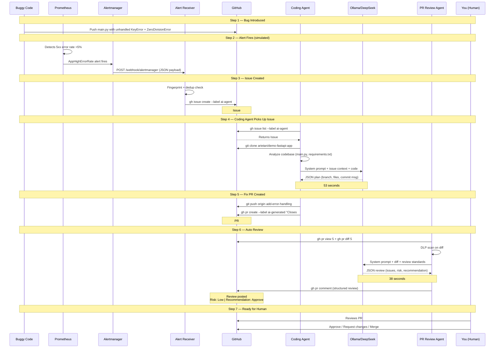
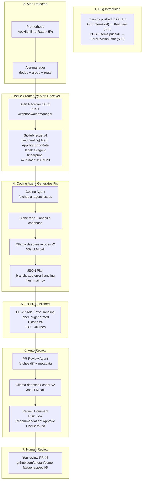

# Self-Healing Pipeline — Demo Run

> **Note:** This document records a real demo run. Repository names, PR URLs,
> and usernames below are from the original demo environment and are kept
> for authenticity. Replace them with your own values when reproducing.

**Date:** 8 April 2026
**Target repo:** `arietan/demo-fastapi-app`
**LLM:** `deepseek-coder-v2:latest` via local Ollama
**Total autonomous time from alert to reviewed PR:** ~101 seconds

---

## Sequence Diagram



## Architecture-Level Flow



## Step-by-Step Detail

### Step 1 — Bug Introduced

Pushed `main.py` to `arietan/demo-fastapi-app` with two deliberate bugs:

```python
@app.get("/items/{item_id}")
def get_item(item_id: int):
    # BUG: no KeyError handling — causes 500 when item not found
    item = items_db[item_id]
    return {"item": item}

@app.post("/items")
def create_item(name: str, price: float):
    # BUG: division by zero when price is 0 (no validation)
    discount_factor = 100 / price
    ...
```

### Step 2 — Alert Fires

In production, Prometheus evaluates:

```yaml
- alert: AppHighErrorRate
  expr: (rate(http_requests_total{status=~"5.."}[5m]) / (rate(http_requests_total[5m]) + 0.001)) > 0.05
  for: 5m
  labels:
    severity: high
  annotations:
    summary: "High HTTP 5xx error rate (>5%)"
```

Alertmanager deduplicates, groups by `alertname` + `namespace`, and routes to the Alert Receiver webhook.

### Step 3 — Alert Receiver Creates GitHub Issue

The Alert Receiver (`agents/self-healing/alert_receiver.py`) received:

```json
{
  "status": "firing",
  "alerts": [{
    "labels": { "alertname": "AppHighErrorRate", "severity": "high" },
    "annotations": {
      "summary": "High HTTP 5xx error rate (>5%) on demo-fastapi-app",
      "description": "GET /items/{item_id} returns 500 (KeyError)... POST /items returns 500 (ZeroDivisionError)..."
    }
  }]
}
```

It performed:
- Fingerprint computation: `472934ac1e33a520`
- Cooldown check: not in cooldown
- Dedup check: no existing open issue with this fingerprint
- Created **Issue #4**: `[self-healing] Alert: AppHighErrorRate` with label `ai-agent`

**Duration:** 3 seconds

### Step 4 — Coding Agent Generates Fix

The Coding Agent (`agents/coding-agent/coding_agent.py`) ran:

```
19:22:46 Cloning arietan/demo-fastapi-app
19:22:48 Found 1 issues labelled 'ai-agent'
19:22:48 Task context gathered (1240 chars)
19:22:48 Codebase analysis complete (270 chars)
19:22:48 Sending 1520 chars to ollama/deepseek-coder-v2:latest
19:23:42 LLM response received
19:23:42 Plan: branch=add-error-handling, files=1
```

LLM returned a JSON plan with error handling for both bugs. The agent applied the changes and pushed.

**Duration:** 53 seconds (mostly LLM inference)

### Step 5 — Fix PR Created

**PR #5:** [Add Error Handling to Improve App Stability](https://github.com/arietan/demo-fastapi-app/pull/5)

- Branch: `add-error-handling`
- Label: `ai-generated`
- Body references `Closes #4`
- +30 / -40 lines changed

### Step 6 — PR Review Agent Auto-Reviews

The PR Review Agent (`agents/pr-review-agent/pr_review_agent.py`) ran:

```
19:24:01 Reviewing PR #5 on arietan/demo-fastapi-app
19:24:03 Sending 2930 chars to ollama for review
19:24:41 Review: 1 issues, recommendation=approve
19:24:43 Posted review comment on PR #5
```

Posted review:

> **Risk Level:** 🟢 Low
> **Recommendation:** ✅ Approve
>
> The PR introduces robust error handling for potential issues such as non-existent item IDs and division by zero. This should significantly improve the app's stability.
>
> **Issues (1):** GET /items/{item_id} does not handle the KeyError exception.
>
> **Strengths:**
> - Improved error handling to avoid server crashes
> - Enhanced input validation through Pydantic models

**Duration:** 38 seconds

### Step 7 — Ready for Human Review

PR #5 is open at: https://github.com/arietan/demo-fastapi-app/pull/5

The AI review provides context, but the PR description explicitly states: *"Human review required before merge."*

## Timeline Summary

| Step | Component | What happened | Duration |
|------|-----------|---------------|----------|
| 1 | Developer | Pushed buggy `main.py` with unhandled exceptions | — |
| 2 | Prometheus | Detects 5xx rate >5%, fires `AppHighErrorRate` | (simulated) |
| 3 | Alert Receiver | Receives webhook, dedup check, creates Issue #4 | 3s |
| 4 | Coding Agent | Clones repo, analyzes code, calls LLM, generates fix | 53s |
| 5 | Coding Agent | Pushes branch, creates PR #5 with `ai-generated` label | 7s |
| 6 | PR Review Agent | Fetches diff, calls LLM, posts structured review | 38s |
| 7 | Human | PR #5 ready for review | — |

**Total autonomous time from alert to reviewed PR: ~101 seconds.**

## Key Observations

1. **The LLM fix was not perfect** — it rewrote `main.py` more aggressively than needed and introduced a stale `import items_db`. This is expected and is exactly why the pipeline keeps a human in the loop.
2. **Deduplication works** — the alert receiver uses SHA-256 fingerprints embedded in issue bodies to prevent duplicate issues for the same alert.
3. **Audit trail is maintained** — every step (run_start, llm_call, pr_created, review_posted) produces a hash-chained audit record in `/tmp/agent-audit/`.
4. **The pipeline is model-agnostic** — swapping `deepseek-coder-v2` for a more capable model (e.g., Claude, GPT-4o) would improve fix quality without changing any pipeline code.
